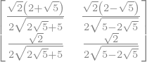

# Tutorial rápido de Python para Matemáticos

© Ricardo Miranda Martins, 2022 - http://www.ime.unicamp.br/~rmiranda/

## Índice

1. [Introdução](http://www.ime.unicamp.br/~rmiranda/python.html) 
2. [Python é uma boa calculadora!](2-calculadora.html) [(código fonte)](2-calculadora.ipynb)
3. [Resolvendo equações](3-resolvendo-eqs.html)  [(código fonte)](3-resolvendo-eqs.ipynb)
4. [Gráficos](4-graficos.html)  [(código fonte)](4-graficos.ipynb)
5. [Sistemas lineares e matrizes](5-lineares-e-matrizes.html)  [(código fonte)](5-lineares-e-matrizes.ipynb)
6. [Limites, derivadas e integrais](6-limites-derivadas-integrais.html)  [(código fonte)](6-limites-derivadas-integrais.ipynb)
7. [Equações direrenciais](7-equacoes-diferenciais.html)  [(código fonte)](7-equacoes-diferenciais.ipynb)

# Limites

Conhece aquela famosa piadinha? "Tudo tem limites, menos $1/x$ com $x\rightarrow 0$." Matemáticos tem um senso de humor bem peculiar.

O Python sabe muito bem trabalhar com limites, graças ao pacote SymPy. Não é nada recomendável calcular limites fazendo "tabelinhas" ou "aproximações", então o pacote de cálculo simbólico é o ideal.

Para calcular $$\lim_{x\rightarrow a} f(x)$$ o comando é ```sp.limit(f,x,a)```. A variável $x$ precisa anter ser definida.


```python
import sympy as sp
x = sp.symbols('x')
sp.limit(x**2,x,2)
```


$\displaystyle 4$


Bom, não vamos ficar usando o Python para calcular limites que sabemos calcular de cabeça, só substituindo os valores né? Vamos a alguns mais complicados. Por exemplo, que tal calcular $$\lim_{x\rightarrow 0} \dfrac{\sin(x)}{x}?$$


```python
sp.limit(sp.sin(x)/x,x,0)
```


$\displaystyle 1$


Isso significa que as funções $f(x)=\sin(x)$ e $g(x)=x$ são muito parecidas, para valores pequenos de $x$. Vamos fazer um gráfico para conferir isso:


```python
import numpy as np
import matplotlib.pyplot as plt
x = np.linspace(-0.5, 0.5, 100)
y = np.sin(x)
plt.plot(x, y)
plt.plot(x, x)
```


    [<matplotlib.lines.Line2D at 0x7f79dab1fdc0>]


​    

​    


E os limites que não existem? Também podem ser calculados!


```python
import sympy as sp
x = sp.symbols('x')
sp.limit(1/(x-2),x,2)
```


$\displaystyle \infty$


Podemos calcular também limites com $x\rightarrow\infty$. No SymPy, o símbolo para infinito é ```oo```, lembrando do prefixo ```sp```. Sugestivo, não?


```python
sp.limit(1/x,x,sp.oo)
```


$\displaystyle 0$


Podemos ainda calcular limites laterais no Python, usando os símboos ```+``` ou ```-``` no comando.


```python
sp.limit(1/x, x, 0, '+')
```


$\displaystyle \infty$


```python
sp.limit(1/x, x, 0, '-')
```


$\displaystyle -\infty$


Já vamos começar a falar sobre derivadas, mas podemos calculá-las pela definição, usando limites. Abaixo faremos um exemplo disso.


```python
import sympy as sp
x, h = sp.symbols('x h', real=True)
f=x**2
fh=f.subs(x,x+h)
sp.limit( (fh-f)/h , h, 0)
```


$\displaystyle 2 x$


O Python trabalha muito bem com funções definidas por partes. Abaixo fazemos um exemplo disso.


```python
import sympy as sp
x = sp.symbols('x', real=True)
g=sp.Piecewise((x**2+1, x<1),(3*x, x>1))
```


```python
sp.limit(g,x,1,'-')
```


$\displaystyle 2$


```python
sp.limit(g,x,1,'+')
```


$\displaystyle 3$


Aviso importante: o Python não é muito bom com funções definidas por partes, tome cuidado com os resultados.

# Derivadas

Se você já fez um curso de cálculo, deve ter percebido que derivação é um processo extremamente mecânico. Não é difícil implementar um "derivador formal". O Python calcula derivadas de funções de uma ou mais variáveis de forma muito eficiente. Novamente vamos usar o SymPy.

Sem mais delongas vamos calcular a derivada de $f(x)=x^2+x$ com respeito à função $x$.


```python
import sympy as sp
x = sp.symbols('x')
f=x**2+x
sp.diff(f,x)
```


$\displaystyle 2 x + 1$


Foi rápido, né? A função pode ser muito mais complicada, como por exemplo $g(x)=e^{x^3+x}+1/x$.


```python
g=sp.exp(x**3+x)+1/x
sp.diff(g,x)
```


$\displaystyle \left(3 x^{2} + 1\right) e^{x^{3} + x} - \frac{1}{x^{2}}$


As funções podem ser de mais que uma variável:


```python
y = sp.symbols('y')
h=sp.cos(x*y)+(3*x+y)/(y**2+1)
```


```python
# derivada em x
sp.diff(h,x)
```


$\displaystyle - y \sin{\left(x y \right)} + \frac{3}{y^{2} + 1}$


```python
# derivada em y
sp.diff(h,x)
```


$\displaystyle - y \sin{\left(x y \right)} + \frac{3}{y^{2} + 1}$


```python
# derivada mista, em x depois em y
sp.diff(h,x,y)
```


$\displaystyle - (x y \cos{\left(x y \right)} + \frac{6 y}{\left(y^{2} + 1\right)^{2}} + \sin{\left(x y \right)})$


Claro que as derivadas de ordem superior também podem ser pedidas de forma iterada:


```python
sp.diff(sp.diff(h,x),y)
```


$\displaystyle - x y \cos{\left(x y \right)} - \frac{6 y}{\left(y^{2} + 1\right)^{2}} - \sin{\left(x y \right)}$


Para derivadas de ordem superior, também é fácil. Abaixo calculamos a derivada de terceira ordem de $h(x,y)$ com respeito a $x$


```python
sp.diff(h,x,x,x)
```


$\displaystyle y^{3} \sin{\left(x y \right)}$


Se você quer a derivada em um ponto, pode usar o ```subs``` para avaliar a derivada nesse ponto:


```python
sp.diff(h,x).subs(x,0).subs(y,0)
```


$\displaystyle 3$


Claro que a função precisa estar definida no ponto, ou coisas podem dar errado..


```python
sp.diff(g,x).subs(x,0).subs(y,0)
```


$\displaystyle \tilde{\infty}$


## Expansão em séries

Uma importante aplicação das derivadas é o cálculo da expansão em série de Taylor. O SymPy tem dois comandos para isso, o ```fps``` e o ```series```. Vamos testá-los com a função $f(x)=x\cos(x)$.


```python
import sympy as sp
x = sp.symbols('x')
f=x*sp.cos(x)
```


```python
# calculando a expansao formal de f em serie de potencias
# com respeito aa variavel x, no ponto x=0, e truncando
# em ordem 10 usando o fps
fn=sp.fps(f,x,0).truncate(10)
display(fn)
```


$\displaystyle x - \frac{x^{3}}{2} + \frac{x^{5}}{24} - \frac{x^{7}}{720} + \frac{x^{9}}{40320} + O\left(x^{10}\right)$


```python
# o comando series tambem funciona: a sintaxe é 
# series(f(x),x,x0,k), onde x0 
fm=sp.series(f,x,0,20).as_expr()
display(fm)
```


$\displaystyle x - \frac{x^{3}}{2} + \frac{x^{5}}{24} - \frac{x^{7}}{720} + \frac{x^{9}}{40320} - \frac{x^{11}}{3628800} + \frac{x^{13}}{479001600} - \frac{x^{15}}{87178291200} + \frac{x^{17}}{20922789888000} - \frac{x^{19}}{6402373705728000} + O\left(x^{20}\right)$


Se você não está ligando o nome à pessoa, uma aplicação interessante das séries de potências de uma função é poder calcular aproximações de valores de uma função $f(x)$ que não permite cálculos "diretos".

Por exemplo, não sabemos calcular diretamente $e^2$, mas usando a série da exponencial, podemos aproximar esse valor tão bem quanto quisermos. Vamos usar o sufixo ```removeO``` para remover da série de Taylor a parte que tem os termos em $O(n)$.


```python
import sympy as sp
x = sp.symbols('x')
g = sp.exp(x)
gk = sp.series(g,x,0,10).removeO()
gk.subs(x,2)
```


$\displaystyle \frac{20947}{2835}$


Portanto, $20947/2835$ é uma boa aproximação racional para $e^2$. Bom, o que estamos fazendo é uma coisa totalmente sem propósito, já que estamos fazendo isso no computador e um simples comando poderia calcular. Mas é aquele famoso "toy problem". Só por curiosidade, note que:


```python
20947//2835
```


$\displaystyle 7$


Portanto, $e^2$ está perto de 7. Como bônus, se você decorar a série abaixo, poderá tirar aquela onda no churrasco do fim de ano e calcular aproximações para $e^x$ para valores de $x$ próximos de $0$. Certamente, vai ser um sucesso.


```python
sp.series(g,x,0,20).as_expr().removeO()
```


$\displaystyle \frac{x^{19}}{121645100408832000} + \frac{x^{18}}{6402373705728000} + \frac{x^{17}}{355687428096000} + \frac{x^{16}}{20922789888000} + \frac{x^{15}}{1307674368000} + \frac{x^{14}}{87178291200} + \frac{x^{13}}{6227020800} + \frac{x^{12}}{479001600} + \frac{x^{11}}{39916800} + \frac{x^{10}}{3628800} + \frac{x^{9}}{362880} + \frac{x^{8}}{40320} + \frac{x^{7}}{5040} + \frac{x^{6}}{720} + \frac{x^{5}}{120} + \frac{x^{4}}{24} + \frac{x^{3}}{6} + \frac{x^{2}}{2} + x + 1$


# Integrais

E chegamos nas integrais. O integrador do SymPy é muito rápido e eficiente, e é o companheiro que gostaríamos de ter na hora da prova de cálculo. Resolver uma integral no Python é muito fácil: o comando é ```integrate(f,x)``` ou ```integrate(f,(x,a,b))``` se for uma integral definida, com $x\in[a,b]$.


```python
import sympy as sp
x = sp.symbols('x')
f=x**2
sp.integrate(f,x)
```


$\displaystyle \frac{x^{3}}{3}$


```python
import sympy as sp
x = sp.symbols('x')
g=x*sp.exp(x)
sp.integrate(g,x)
```


$\displaystyle \left(x - 1\right) e^{x}$


```python
import sympy as sp
x = sp.symbols('x')
h=sp.exp(x)*sp.cos(x)
sp.integrate(h,x)
```


$\displaystyle \frac{e^{x} \sin{\left(x \right)}}{2} + \frac{e^{x} \cos{\left(x \right)}}{2}$


Bom, como você percebeu, o SymPy teria perdido $0.1$ em cada integral anterior - esqueceu a constante de integração.. coisa feia, Python. Alguns exemplos de integrais definidas:


```python
p=x**3+x
sp.integrate(p,(x,0,1))
```


$\displaystyle \frac{3}{4}$


```python
# vamos tentar enganar o python?
q=1/(x-2)
sp.integrate(q,(x,0,3))
```


$\displaystyle \text{NaN}$


Garoto esperto..

O Python também consegue calcular integrais impróprias, lembrando que o símbolo ```oo``` é usado para "infinito".

Atenção: se você tem menos que 18 anos, não execute o próximo comando!!


```python
sp.integrate(sp.exp(-x**2), (x, 0, sp.oo))
```


$\displaystyle \frac{\sqrt{\pi}}{2}$


Mais um exemplo de integral imprópria:


```python
sp.integrate(1/(x**(6)), (x, 1,sp.oo))
```


$\displaystyle \frac{1}{5}$


A integração de funções de várias variávies, principalmente se o domínio for um retângulo, também pode ser feita sem problemas no Python:


```python
x, y, a, b, c, d = sp.symbols("x y a b c d")
f = x*y
sp.integrate(f, (y, a, b), (x, c, d))
```


$\displaystyle - c^{2} \left(- \frac{a^{2}}{4} + \frac{b^{2}}{4}\right) + d^{2} \left(- \frac{a^{2}}{4} + \frac{b^{2}}{4}\right)$


Também podemos integrar sobre regiões um pouco mais gerais, as chamadas regiões de tipo I/tipo II, ou regiões $R_x$ ou $R_y$:


```python
x, y, a, b, c, d = sp.symbols("x y a b c d")
f = x**2+y
sp.integrate(f, (y, 0, x+1), (x, 0, 1))
```


$\displaystyle \frac{7}{4}$


## Somas de Riemann

Na primeira aula de integrais, começamos com integrais definidas, fazendo umas figuras sobre somas de Riemann. Acredite em mim: é complicado fazer isso manualmente, pois os cálculos são complicados e os desenhos são chatos de fazer. Que tal usar o Python pra facilitar nossa vida? Facilitará tanto o trabalho do professor quanto do aluno, que entenderá melhor.

A implementação abaixo foi adaptada do Mathematical Python [(nesse site)](https://personal.math.ubc.ca/~pwalls/math-python/integration/riemann-sums/).


```python
import numpy as np
import matplotlib.pyplot as plt

# originamente, a função foi definida com a definicao lambda,
# que de fato é mais simples nesse caso - caso queira saber
# mais sobre ela, leia aqui:
# https://stackabuse.com/lambda-functions-in-python/
# f = lambda x : x**2

# definindo a função
def f(x):
    return x**2

# intervalo
a = 0; b = 10;

# numero de retangulos
N = 10

n = 10 # Use n*N+1 points to plot the function smoothly

# discretizando variáveis
x = np.linspace(a,b,N+1)
y = f(x)
X = np.linspace(a,b,n*N+1)
Y = f(X)

# iniciando plot
plt.figure(figsize=(15,5))
plt.subplot(1,3,1)
plt.plot(X,Y,'b')
x_left = x[:-1]
y_left = y[:-1]
plt.plot(x_left,y_left,'b.',markersize=10)
plt.bar(x_left,y_left,width=(b-a)/N,alpha=0.2,align='edge',edgecolor='b')
plt.title('Soma de Riemann com base na esquerda'.format(N))

plt.show()
```


​    

​    


```python

```
