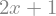
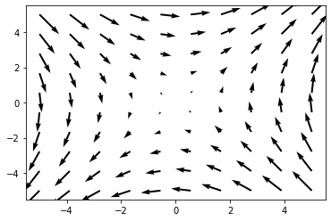
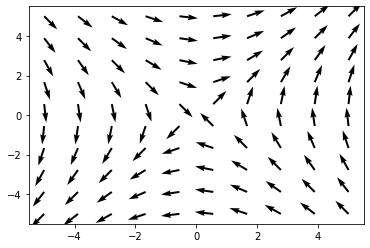
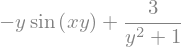
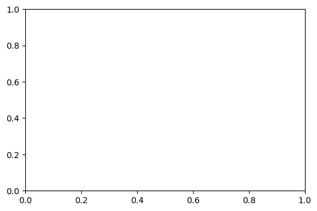
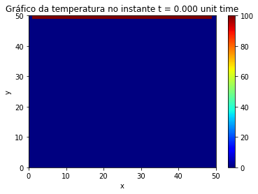

# Tutorial rápido de Python para Matemáticos

&copy; Ricardo Miranda Martins, 2022 - http://www.ime.unicamp.br/~rmiranda/

## Índice

1. [Introdução](1-intro.html) 
2. [Python é uma boa calculadora!](2-calculadora.html) [(código fonte)](2-calculadora.ipynb)
3. [Resolvendo equações](3-resolvendo-eqs.html)  [(código fonte)](3-resolvendo-eqs.ipynb)
4. [Gráficos](4-graficos.html)  [(código fonte)](4-graficos.ipynb)
5. [Sistemas lineares e matrizes](5-lineares-e-matrizes.html)  [(código fonte)](5-lineares-e-matrizes.ipynb)
6. [Limites, derivadas e integrais](6-limites-derivadas-integrais.html)  [(código fonte)](6-limites-derivadas-integrais.ipynb)
7. [Equações direrenciais](7-equacoes-diferenciais.html)  [(código fonte)](7-equacoes-diferenciais.ipynb)


# Equações diferenciais

Chegamos no capítulo que motivou essas notas: vamos usar o Pythonn para resolver equações diferenciais!

Começaremos resolvendo algumas equações usando o SymPy. Ele não é a melhor ferramenta para isso, pois só procura soluções "algébricas" (no sentido de poderem ser explicitadas), mas para começar a brincar, já funciona bem.

## Equações lineares de primeira e segunda ordens

Primeiro vamos resolver uma equação simples: encontrar $f(x)$ tal que $$f'(x)+f(x)=0.$$ A notação para $f'(x)$ é um pouco estranha: para representar $f(t)$, devemos digitar ```f(t).diff(t)```. Se quiser a derivada de segunda ordem, $f''(t)$, entre ```f(t).diff(t,t)``` e por aí vai.

Depois disso, é só usar o comando ```dsolve```.


```python
import sympy as sp

# definindo a variavel independente
t = sp.symbols('t')

# definindo símbolos para as funcoes que estarão envolvidas
# nas equações diferenciais.
# note que precisamos já declarar esses símbolos como sendo
# da classe "função" com a adição cls=sp.Function
f = sp.symbols('f', cls=sp.Function)

# defina a equacao diferencial. para representar f'(t)
# deve-se usar f(t).diff(t).
# para indicar f''(t) usamos f(t).diff(t,t).
# a equacao sera na forma F=0. defina eq=F.
eq=f(t).diff(t) + f(t)

# resolvendo a equacao
sp.dsolve(eq, f(t))
```


$\displaystyle f{\left(t \right)} = C_{1} e^{- t}$


Pronto! Está aí a solução da equação diferencial, já com a constante de integração. Vamos resolver agora uma equação de segunda ordem, $$g''(t)-2g'(t)+g(t)=0.$$


```python
import sympy as sp
t = sp.symbols('t')
g = sp.symbols('g', cls=sp.Function)
eq=g(t).diff(t,t) -2*g(t).diff(t) +g(t)
sp.dsolve(eq, g(t))
```


$\displaystyle g{\left(t \right)} = \left(C_{1} + C_{2} t\right) e^{t}$


Vamos piorar um pouco a equação diferencial e tentar resolver $$q''(t)-6q'(t)+2q(t)-t\cos(t)=0.$$


```python
import sympy as sp
t = sp.symbols('t')
q = sp.symbols('q', cls=sp.Function)
eq=q(t).diff(t,t) -6*q(t).diff(t) +2*q(t)-t*sp.cos(t)
sp.dsolve(eq, q(t))
```


$\displaystyle q{\left(t \right)} = C_{1} e^{t \left(3 - \sqrt{7}\right)} + C_{2} e^{t \left(\sqrt{7} + 3\right)} - \frac{6 t \sin{\left(t \right)}}{37} + \frac{t \cos{\left(t \right)}}{37} - \frac{142 \sin{\left(t \right)}}{1369} - \frac{186 \cos{\left(t \right)}}{1369}$


Para resolver adicionando condições iniciais, podemos complementar o comando. Vamos fazer isso, só para poder plotar um gráfico - adoramos gráficos. A condição inicial $q(0)=1$, $q'(0)=1$ é entrada como a opção ```ics={q(0): 1, q(t).diff(t).subs(t, 0): 1}``` dentro do ```dsolve```.


```python
import sympy as sp
t = sp.symbols('t')
q = sp.symbols('q', cls=sp.Function)
eq=q(t).diff(t,t) -6*q(t).diff(t) +2*q(t)-t*sp.cos(t)

# encontrando a solucao e armazenando no nome "solucao"
solucao=sp.dsolve(eq, q(t), ics={q(0): 1, q(t).diff(t).subs(t, 0): 1})

sp.plot(solucao.rhs,(t,-2,2),ylim=[-5,5])
```


    <sympy.plotting.plot.Plot at 0x7fbfd4b81fa0>


## Sistemas de equações diferenciais

Para resolver/plotar sistemas de equações diferenciais, até podemos usar o SymPy, mas é muito mais eficiente usar o NumPy (ou uma mistura dele com o SciPy). Parte do código abaixo foi inspirado [desse site](https://danielmuellerkomorowska.com/2021/02/11/differential-equations-in-python-with-scipy/). Vamos usar como exemplo o que é, talvez, o sistema de equações diferenciais cujo retrato de fase ilustra mais livros em todo o mundo!

O sistema de Lorenz é definido como
$$\left\{
\begin{array}{lcl}
\dot x&=&\sigma (y-x),\\
\dot y&=& x(\rho-z)-y,\\
\dot z&=&xy-\beta z,
\end{array}
\right.
$$
onde $\sigma,\rho,\beta$ são parâmetros. O sistema de Lorenz é uma simplificação de um modelo atmosférico. Os valores mais utilizados desses parâmetros, como feito pelo próprio Lorenz, são $\sigma=10$, $\beta=8/3$ e $\rho=28$.

O comando base para resolver sistemas de equações é o ```odeint```, mas ele tem alguns detalhes.


```python
import numpy as np
import matplotlib.pyplot as plt
from scipy.integrate import odeint

def lorenz(state, t, sigma, beta, rho):
    x, y, z = state
    dx = sigma * (y - x)
    dy = x * (rho - z) - y
    dz = x * y - beta * z
    return [dx, dy, dz]

# valores dos parametros
sigma = 10.0
beta = 8.0 / 3.0
rho = 28.0

# parametros
p = (sigma, beta, rho)

# condicao inicial
ic = [1.0, 1.0, 1.0]

# tempo inicial, tempo final, tamanho da partição.
# se você colocar uma partição muito grande, então serão
# usados menos pontos para avaliar a função, e com isso
# terá a impressão de que são vários segmentos de reta.
# experimente um pouco com isso.
t = np.arange(0.0, 60.0, 0.001)

# integrando
result = odeint(lorenz, ic, t, p)

# plotando
fig = plt.figure()
ax = plt.axes(projection='3d')
ax.plot(result[:, 0], result[:, 1], result[:, 2])

fig2 = plt.figure()
plt.plot(t,result[:, 0])
plt.plot(t,result[:, 1])
plt.plot(t,result[:, 2])
```


    [<matplotlib.lines.Line2D at 0x7fbf861d62e0>]


Soluções para sistemas bidimensionais também podem ser plotadas de forma muito similar. Como antes, vamos plotar a curva solução $(x(t),y(t))$ e depois, num mesmo gráfico, $x(t)$ e $y(t)$. Nosso eleito para o exemplo bidimensional é o oscilador de van der Pol.

A equação de segunda ordem $$x''-\mu(1-x^2)x'+x=0$$ é conhecida como oscilador de van der Pol, em homenagem ao matemático holandês Balthasar van der Pol (ok, ele era engenheiro e físico, mas acho que não ficaria triste em ser chamado de matemático) que a deduziu na década de 20, enquanto trabalhava na Philips com circuitos elétricos (veja detalhes [aqui](https://en.wikipedia.org/wiki/Van_der_Pol_oscillator) na Wikipedia). Essa equação de segunda ordem pode ser escrita como um sistema de equações de primeira ordem:
$$\left\{
\begin{array}{lcl}
\dot x&=&\mu(1-y^2)x-y,\\
\dot y&=& x.\\
\end{array}
\right.
$$

É fato conhecido que o oscilador de van der Pol admite um ciclo limite (uma órbita periódica atratora) para certos valores do parâmetro $\mu$. Vejamos como isso acontece ao fazer o gráfico: a solução começa em um certo ponto inicial e depois tende a uma curva fechada. Essa curva não pode ser expressada em termos algébricos, ela é uma curva transcendente. Vamos ao código:


```python
import numpy as np
import matplotlib.pyplot as plt
from scipy.integrate import odeint

# define o sistema de van der pol
def sistema(variaveis, t):
    x, y = variaveis
    dx = 3*(1-y**2)*x-y
    dy = x
    return [dx, dy]

# define a condicao inicial, onde 
# ic=[ x(0), y(0)]
ic = [0.1,0.2]

# define o tempo - será usado pelo integrador e também
# pelo plot
t = np.arange(0, 40, 0.0001)

# integrando
result = odeint(sistema, ic, t)

# primeiro plot
fig = plt.figure()
ax = plt.axes()
# plotando a curva-solucao
ax.plot(result[:, 0], result[:, 1])

# agora plotando x(t) e y(t) separadamente num segundo plot
fig2=plt.figure()
plt.plot(t,result[:, 0])
plt.plot(t,result[:, 1])
```


    [<matplotlib.lines.Line2D at 0x7fbfc0b7c070>]


Note como no sistema de van der Pol, o plot das soluções $x(t),y(t)$ a partir de um certo $t$ parece o de uma função periódica, o que não acontece no sistema de Lorenz. Isso é justificado pela presença de um ciclo limite atrator no sistema de van der Pol, enquanto o sistema de Lorenz apresenta comportamento caótico.

Acima usamos o ```odeint``` para encontrar a solução de forma numérica antes de plotá-la, e o plot era sempre com $t\in[0,t_0]$, com $t_0>0$. O motivo para isso é que o ```odeint``` não funciona bem com tempos negativos. Uma possibilidade para resolver isso é usar o ```solve_ivp```. A página com manual dele [pode ser vista nesse link](https://docs.scipy.org/doc/scipy/reference/generated/scipy.integrate.solve_ivp.html), e é bem detalhada. Vamos resolver novamente o oscilador de van der Pol, agora com o ```solve_ivp```:


```python
from scipy.integrate import solve_ivp
import matplotlib.pyplot as plt

# note que agora que queremos usar o solve_ivp precisamos
# colocar o t como primeira variável, ao contrário de quando
# queríamos usar o odeint.
def sistema(t, variaveis):
    x, y = variaveis
    dx = 3*(1-y**2)*x-y
    dy = x
    return [dx, dy]

# condicao inicial
ic=[0.1,0.2]

# basicamente a sintaxe eh solve_ivp(sistema [t0,t1], ic). adicionamos
# a opcao dense_output para ficar mais facil recuperar as solucoes para
# que sejam plotadas.

solucao = solve_ivp(sistema, [-40, 40], ic,dense_output=True)

# agora discretizamos o tempo para plotar. é preciso ser compatível com
# o intervalo do tempo que foi passado para o comando solve_ivp
t = np.arange(-40, 40, 0.0001)

# a propriedade sol(t) da solucao carrega em suas colunas os valores
# de x(t) e y(t). para usar no plot, precisamos que isso esteja nas linhas,
# por isso usamos o .T no final, para calcular a transposta. isso vai plotar
# as solucoes x(t), y(t)
plt.plot(t,solucao.sol(t).T)

# agora criamos outra janela gráfica e plotamos a curva parametrizada.
# usamos [:,0] para acessar a primeira linha da matriz solucao.sol(t)
# e [:,1] para acessar a segunda linha. isso vai produzir um plot de
# curva parametrizada, como já sabemos fazer.
fig=plt.figure()
plt.plot(solucao.sol(t).T[:, 0],solucao.sol(t).T[:, 1])
```


    [<matplotlib.lines.Line2D at 0x7fbf85085610>]


Compare os gráficos e as curvas: são bem parecidas! (Claro!!)

## Retratos de fase e campos de direções

Quando estamos estudando o comportamento de uma função $y=f(x)$, analisar o gráfico da função é um bom ponto de partida - e vimos como fazer gráficos no Python lá no começo desse tutorial.

No caso de equações diferenciais e PVIs, podemos encontrar e plotar a solução, seja na forma de curva parametrizada, seja em termos das coordenadas.

Já para sistemas de equações diferenciais, duas representações gráficas são muito eficientes:

1. o retrato de fase do sistema, que basicamente é o conjunto de todas as soluções, e pode ser representado graficamente/computacionalmente fazendo o esboço de "algumas" curvas-solução (como curvas parametrizadas), de modo a representar o comportamento gloal do sistema e
2. o campo de direções, que é uma representação gráfica do sistema de equações diferenciais (ordinárias e autônomas, claro) como o campo vetorial adjacente, ou seja, se o sistema tem a forma
$$\left\{
\begin{array}{lcl}
\dot x&=&P(x,y),\\
\dot y&=&Q(x,y)
\end{array}
\right.$$
então construímos o campo vetorial $X(x,y)=(P(x,y),Q(x,y))$ e em cada ponto $(a,b)$ do plano cartesiano colocamos o vetor $X(a,b)$. Como o campo vetorial $X$ é tangente às soluções da equação diferencial, isso nos dará uma boa ideia sobre o comportamento qualitativo das soluções da equação.

Para o retrato de fase, já sabemos o que fazer: basta colocar, num mesmo sistema de eixos, várias soluções (ou seja, soluções passando por várias condições iniciais). Isso pode ser feito com um ```for``` para pegar várias condições iniciais e ir plotando, como fazemos no comando abaixo. Confira [esse site aqui](http://www.doc.mmu.ac.uk/STAFF/S.Lynch/DSAP_Jupyter_Notebook.html) para mais alguns exemplos.


```python
%matplotlib inline
import matplotlib.pyplot as plt
import numpy as np
from scipy.integrate import odeint

fig = plt.figure(num=1)
ax=fig.add_subplot(111)

def sistema(t, variaveis):
    x, y = variaveis
    dx = (1-y**2)*x-y
    dy = x
    return [dx, dy]

# trajetórias em tempo positivo
for P in range(-5,5,1):
  for Q in range(-5,5,1):
    solucao = solve_ivp(sistema, [0,10], [P,Q],dense_output=True)
    t = np.linspace(0, 10, 500)
    plt.plot(solucao.sol(t).T[:, 0],solucao.sol(t).T[:, 1])

# trajetórias em tempo negativo
for P in range(-5,5,1):
  for Q in range(-5,5,1):
    solucao = solve_ivp(sistema, [0,-10], [P,Q],dense_output=True)
    t = np.linspace(0, -10, 500)
    plt.plot(solucao.sol(t).T[:, 0],solucao.sol(t).T[:, 1])

# limita a janela de visualização e mostra o plot
plt.xlim(-5,5)
plt.ylim(-5,5)
plt.show()
```


    

    


Vamos a mais dois exemplo, agora considerando um sistema de equações lineares: primeiro o sistema
$$\left\{
\begin{array}{lcl}
\dot x&=&-y,\\
\dot y&=&x,
\end{array}
\right.
$$ que só tem soluções periódicas, e depois o sistema
e depois o sistema
$$\left\{
\begin{array}{lcl}
\dot x&=&y,\\
\dot y&=&x,
\end{array}
\right.
$$ que tem um ponto de sela.


```python
%matplotlib inline
import matplotlib.pyplot as plt
import numpy as np
from scipy.integrate import odeint

fig = plt.figure(num=1)
ax=fig.add_subplot(111)

# um sistema que só tem órbitas periódicas
def sistema(t, variaveis):
    x, y = variaveis
    dx = -y
    dy = x
    return [dx, dy]

# trajetórias em tempo positivo
for P in range(-5,5,1):
  for Q in range(-5,5,1):
    solucao = solve_ivp(sistema, [0,10], [P,Q],dense_output=True)
    t = np.linspace(0, 10, 500)
    plt.plot(solucao.sol(t).T[:, 0],solucao.sol(t).T[:, 1])

# trajetórias em tempo negativo
for P in range(-5,5,1):
  for Q in range(-5,5,1):
    solucao = solve_ivp(sistema, [0,-10], [P,Q],dense_output=True)
    t = np.linspace(0, -10, 500)
    plt.plot(solucao.sol(t).T[:, 0],solucao.sol(t).T[:, 1])

# limita a janela de visualização e mostra o plot
plt.xlim(-5,5)
plt.ylim(-5,5)
plt.show()
```


    

    


```python
%matplotlib inline
import matplotlib.pyplot as plt
import numpy as np
from scipy.integrate import odeint

fig = plt.figure(num=1)
ax=fig.add_subplot(111)

# um sistema que só tem órbitas periódicas
def sistema(t, variaveis):
    x, y = variaveis
    dx = y
    dy = x
    return [dx, dy]

# trajetórias em tempo positivo
for P in range(-5,5,1):
  for Q in range(-5,5,1):
    solucao = solve_ivp(sistema, [0,10], [P,Q],dense_output=True)
    t = np.linspace(0, 10, 500)
    plt.plot(solucao.sol(t).T[:, 0],solucao.sol(t).T[:, 1])

# trajetórias em tempo negativo
for P in range(-5,5,1):
  for Q in range(-5,5,1):
    solucao = solve_ivp(sistema, [0,-10], [P,Q],dense_output=True)
    t = np.linspace(0, -10, 500)
    plt.plot(solucao.sol(t).T[:, 0],solucao.sol(t).T[:, 1])

# limita a janela de visualização e mostra o plot
plt.xlim(-5,5)
plt.ylim(-5,5)
plt.show()
```


    

    


Por fim, um exemplo com MUITAS órbitas traçadas, e que possui tanto uma órbita homoclínica quanto algumas órbitas periódicas.


```python
%matplotlib inline
import matplotlib.pyplot as plt
import numpy as np
from scipy.integrate import odeint

fig = plt.figure(num=1)
ax=fig.add_subplot(111)

# um sistema hamiltoniano com órbitas periódicas e uma órbita homoclínica
def sistema(t, variaveis):
    x, y = variaveis
    dx = -y
    dy = -x-x**2
    return [dx, dy]

# trajetórias em tempo positivo
for P in np.linspace(-2, 2, 20):
  for Q in np.linspace(-2, 2, 20):
    solucao = solve_ivp(sistema, [0,10], [P,Q],dense_output=True)
    t = np.linspace(0, 10, 500)
    plt.plot(solucao.sol(t).T[:, 0],solucao.sol(t).T[:, 1])

# trajetórias em tempo negativo
for P in np.linspace(-2, 2, 20):
  for Q in np.linspace(-2, 2, 20):
    solucao = solve_ivp(sistema, [0,-10], [P,Q],dense_output=True)
    t = np.linspace(0, -10, 500)
    plt.plot(solucao.sol(t).T[:, 0],solucao.sol(t).T[:, 1])

# limita a janela de visualização e mostra o plot
plt.xlim(-2,2)
plt.ylim(-2,2)
plt.show()
```


    

    


Agora que já sabemos plotar retratos de fase, vamos plotar campos de direções, e depois os dois juntos. Vamos usar como base a sela linear. O comando para plotar o campo vetorial é o ```quiver```, dentro do matplotlib. A sintaxe é bem simples.


```python
%matplotlib inline
import matplotlib.pyplot as plt
import numpy as np

# criamos uma malha em R2, com x e y indo de -5 a 5, contendo
# um total de 10 pontos em cada coordenada
x,y = np.meshgrid( np.linspace(-5,5,10),np.linspace(-5,5,10) )

# calculamos o campo vetorial X(x,y)=(y,x) na malha
u = y
v = x

#N = np.sqrt(u**2+v**2)
#U2, V2 = u/N, v/N

# plotando
plt.quiver( x,y,u, v)
```


    <matplotlib.quiver.Quiver at 0x7fbf84f253d0>


    

    


Em alguns casos, pode ser uma boa estratégia normalizar o campo vetorial para que a figura fique melhor. Isso obviamente deforma o campo vetorial, mas para visualização inicial, pode ser útil:


```python
%matplotlib inline
import matplotlib.pyplot as plt
import numpy as np

# criamos uma malha em R2, com x e y indo de -5 a 5, contendo
# um total de 10 pontos em cada coordenada
x,y = np.meshgrid( np.linspace(-5,5,10),np.linspace(-5,5,10) )

# calculamos o campo vetorial X(x,y)=(y,x) na malha
u = y
v = x

# normalizando o campo
N = np.sqrt(u**2+v**2)
U, V = u/N, v/N

# plotando
plt.quiver( x,y,U, V)
```


    <matplotlib.quiver.Quiver at 0x7fbfd4584460>


    

    


Agora nosso *gran finale*: vamos plotar o campo de direções e o retrato de fase num só gráfico. Isso nos dá muita informação sobre o sistema dinâmico.

O código abaixo é o melhor que eu sei fazer, mas provavelmente deve existir uma forma mais eficiente: em particular, eu preciso definir separadamente tanto o sistema de equações diferenciais quanto o campo vetorial e isso não é a forma mais inteligente de fazer isso.


```python
%matplotlib inline
import matplotlib.pyplot as plt
import numpy as np
from scipy.integrate import odeint

fig = plt.figure(num=1)
ax=fig.add_subplot(111)

# um sistema que só tem órbitas periódicas
def sistema(t, variaveis):
    x, y = variaveis
    dx = y
    dy = x
    return [dx, dy]

# calculando e plotando trajetórias em tempo positivo
for P in range(-5,5,1):
  for Q in range(-5,5,1):
    solucao = solve_ivp(sistema, [0,10], [P,Q],dense_output=True)
    t = np.linspace(0, 10, 500)
    plt.plot(solucao.sol(t).T[:, 0],solucao.sol(t).T[:, 1])

# calculando e plotando trajetórias em tempo negativo
for P in range(-5,5,1):
  for Q in range(-5,5,1):
    solucao = solve_ivp(sistema, [0,-10], [P,Q],dense_output=True)
    t = np.linspace(0, -10, 500)
    plt.plot(solucao.sol(t).T[:, 0],solucao.sol(t).T[:, 1])

# grid para os vetores
x,y = np.meshgrid( np.linspace(-5,5,20),np.linspace(-5,5,20) )

# calculando o campo vetorial X(x,y)=(y,x) na malha
u = y
v = x

# normalizando o campo (opcional)
N = np.sqrt(u**2+v**2)
u, v = u/N, v/N

# plotando o campo de direcoes
plt.quiver( x,y,u, v)

# limita a janela de visualização e mostra o plot
plt.xlim(-5,5)
plt.ylim(-5,5)
plt.show()
```


    

    


## EDPs

Se obter de forma explícita soluções para EDOs não é uma coisa simples, para EDPs se torna uma tarefa impossível. Então já partiremos para soluções numéricas desde o começo. Vamos estudar como obter a solução da equação do calor, e nosso objetivo será obter uma representação gráfica animada da evolução da equação (ou seja, como o "calor" se espalha numa região).

Os códigos abaixo foram adaptados dos códigos originais [daqui](https://levelup.gitconnected.com/solving-2d-heat-equation-numerically-using-python-3334004aa01a) e [daqui](http://firsttimeprogrammer.blogspot.com/2015/07/the-heat-equation-python-implementation.html).

Vamos começar com a equação do calor em dimensão 1. A ideia é simples: considere uma barra de ferro (ou outro material) que está fixada pelos dois extremos. Suponha que existe uma distribuição inicial de temperatura. Com o passar do tempo, como a temperatura evolui?

A solução do código abaixo é um pouco fake: nós já pegamos uma animação da solução com o passar do tempo e plotamos.


```python
%matplotlib inline
# descomente abaixo para mostrar em outra janela a animacao
# %matplotlib tk

import numpy as np
from numpy import pi
import matplotlib.pyplot as plt
import matplotlib.animation as animation


fig = plt.figure()
fig.set_dpi(100)
ax1 = fig.add_subplot(1,1,1)

#Diffusion constant
k = 2

#Scaling factor (for visualisation purposes)
scale = 5

#Length of the rod (0,L) on the x axis
L = pi

#Initial contitions u(0,t) = u(L,t) = 0. Temperature at x=0 and x=L is fixed
x0 = np.linspace(0,L+1,10000)
t0 = 0
temp0 = 5  #Temperature of the rod at rest (before heating)

#Increment
dt = 0.01

# Solução da equação do calor
def u(x,t):
    return temp0 + scale*np.exp(-k*t)*np.sin(x)

#Gradient of u
def grad_u(x,t):
                               #du/dx              #du/dt
    return scale*np.array([np.exp(-k*t)*np.cos(x),-k*np.exp(-k*t)*np.sin(x)])

a = []
t = []

for i in range(500):
    value = u(x0,t0) + grad_u(x0,t0)[1]*dt
    t.append(t0)
    t0 = t0 + dt
    a.append(value)

k = 0
def animate(i):         #The plot shows the temperature evolving with time
    global k            #at each point x in the rod
    x = a[k]            #The ends of the rod are kept at temperature temp0
    k += 1              #The rod is heated in one spot, then it cools down
    ax1.clear()
    plt.plot(x0,x,color='red',label='Temperatura em cada ponto x')
    plt.plot(0,0,color='red',label='Tempo decorrido '+str(round(t[k],2)))
    plt.grid(True)
    plt.ylim([temp0-2,2.5*scale])
    plt.xlim([0,L])
    plt.title('Evolução da equação do calor')
    plt.legend()
 
anim = animation.FuncAnimation(fig,animate,frames=360,interval=10)
plt.show()

```


    

    


É muito mais complicado resolver a equação do calor em umd domínio bidimensional. O código abaixo resolve numericamente a equação e plota o resultado numa animação.


```python
%matplotlib inline
# descomente abaixo para mostrar em outra janela a animacao
# %matplotlib tk

import numpy as np
import matplotlib.pyplot as plt
import matplotlib.animation as animation
from matplotlib.animation import FuncAnimation

print("2D heat equation solver")

plate_length = 50
max_iter_time = 750

alpha = 2
delta_x = 1

delta_t = (delta_x ** 2)/(4 * alpha)
gamma = (alpha * delta_t) / (delta_x ** 2)

# Initialize solution: the grid of u(k, i, j)
u = np.empty((max_iter_time, plate_length, plate_length))

# Initial condition everywhere inside the grid
u_initial = 0

# Boundary conditions
u_top = 100.0
u_left = 0.0
u_bottom = 0.0
u_right = 0.0

# Set the initial condition
u.fill(u_initial)

# Set the boundary conditions
u[:, (plate_length-1):, :] = u_top
u[:, :, :1] = u_left
u[:, :1, 1:] = u_bottom
u[:, :, (plate_length-1):] = u_right

def calculate(u):
    for k in range(0, max_iter_time-1, 1):
        for i in range(1, plate_length-1, delta_x):
            for j in range(1, plate_length-1, delta_x):
                u[k + 1, i, j] = gamma * (u[k][i+1][j] + u[k][i-1][j] + u[k][i][j+1] + u[k][i][j-1] - 4*u[k][i][j]) + u[k][i][j]

    return u

def plotheatmap(u_k, k):
    plt.clf()

    plt.title(f"Gráfico da temperatura no instante t = {k*delta_t:.3f} unit time")
    plt.xlabel("x")
    plt.ylabel("y")

    # This is to plot u_k (u at time-step k)
    plt.pcolormesh(u_k, cmap=plt.cm.jet, vmin=0, vmax=100)
    plt.colorbar()

    return plt

# Do the calculation here
u = calculate(u)

def animate(k):
    plotheatmap(u[k], k)

anim = animation.FuncAnimation(plt.figure(), animate, interval=1, frames=max_iter_time, repeat=False)

```

    2D heat equation solver


    /Users/rmiranda/opt/anaconda3/lib/python3.9/site-packages/matplotlib/animation.py:973: UserWarning: Animation was deleted without rendering anything. This is most likely unintended. To prevent deletion, assign the Animation to a variable that exists for as long as you need the Animation.
      warnings.warn(


    

    


```python

```
